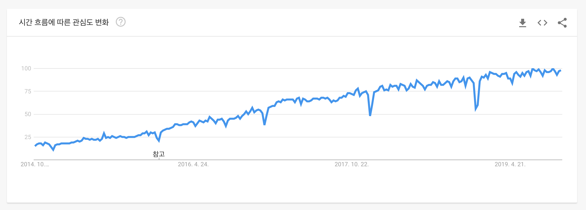

Docker는 컨테이너 기반의 오픈소스 가상화 플랫폼입니다. **컨테이너 기반, 오픈소스,  가상화 플랫폼.** 이 세 가지를 중심으로 Docker가 무엇이고, 어떤 장점을 가지고 있는지 정리해보려고 합니다.

## Open Source
Docker가 처음 세상에 등장한 것은 Pycon 2013에서의 *"The future of Linux containers"*라는 제목의 발표였습니다. 첫 등장은 5분 가량의 짧은 소개에 불과했지만 이후 꾸준한 인기를 얻으면서 널리 사용되고 있습니다.

Docker는 오픈소스이며, Apache License 2.0 라이센스를 따르고 있습니다. Docker 소스는 [github](https://github.com/docker/docker-ce)에서 볼 수 있습니다.

## Virtualization
*가상화* 하면 보통 가장 먼저 떠오르는 것은 한 번쯤 사용해봤던 VM(가상머신)일 것입니다. 가상머신은 OS를 가상화하여 내 컴퓨터(호스트) OS 위에 또 다른 OS(게스트)를 사용합니다. *게스트 OS는 호스트를 거쳐 하드웨어를 사용하기 때문에 느립니다.*

Docker는 VM과 달리 운영체제는 호스트의 운영체제를 공유하고, 그 위의 파일시스템부터 가상화하여 프로세스를 격리하였기 때문에 **VM에 비해 훨씬 용량이 작고 실행도 빠릅니다.** 이런 방식을 컨테이너라고 하는데, Docker 이전에 LXC(리눅스 컨테이너), Jail, Solaris zones 등 여러 운영체제별로 컨테이너 기술이 존재했습니다.

각각의 운영체제에 의존적이었던 기존의 컨테이너 기술과 달리 Docker는 Linux, Unix, Windows 등 **다양한 운영체제를 지원**합니다. 그래서 애플리케이션의 실행환경을 컨테이너화하면 **Docker가 설치된 다른 운영체제에서도 동일한 실행환경을 쉽게 만들 수 있습니다**.

> 기준이 되는 Host OS가 리눅스이기 때문에, Unix나 Windows 운영체제에서는 Hypervisor 위에 Linux를 얹고 그 위에서 동작합니다.

## Container Based
원래 컨테이너는 화물 운송에 사용되는 규격화 된 통을 말합니다. 일정하게 만들어져 있기 때문에 여러 운송수단으로 쉽게 운반할 수 있다는 장점을 가지고 있습니다.

Docker에서 사용되는 개념의 Container 또한 유사한 장점을 가지고 있습니다. 다양한 애플리케이션의 실행 환경을 컨테이너라는 규격화 된 단위로 만들어서 Docker의 인터페이스를 통해 어디에서나 쉽게 애플리케이션을 실행, 배포할 수 있습니다.

## Why use Docker?
위에서 살펴본 것과 같이 Docker는 가볍고(lightweight), 유연(flexible)하기 때문에 많은 사람들이 사용하고 있습니다.

어떤 복잡한 애플리케이션이라도 실행에 필요한 파일과 의존성, 설정을 이미지로 저장하면 컨테이너를 생성하여 쉽게 실행환경을 만들 수 있습니다. 호스트의 커널을 공유하기 때문에 메모리 사용량 등 overhead가 적습니다.

새로운 의존성이 추가되거나 버전이 업그레이드 되어도 변경된 내용을 담은 이미지를 만들면 배포환경에도 손쉽게 적용할 수 있습니다.
