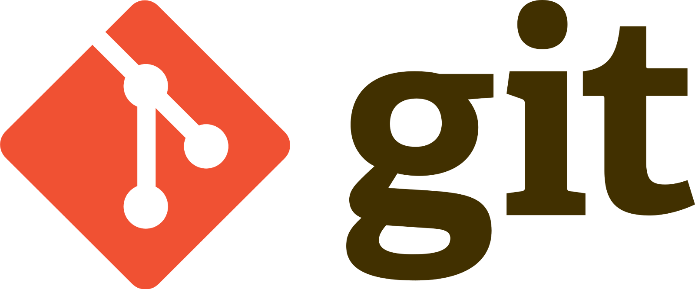

많은 채용 공고를 보면 git 사용 경험이 있는 개발자를 원한다는 것을 알 수 있습니다. 버전 관리 도구인 git, 왜 써야할까요? 

## Before Git
처음 git을 알게 된 것은 2학년 때 였던 것으로 기억합니다. 그 때 당시 저에게 소스코드란 ‘과제를 제출하고 나면 폐기하는 것’ 정도로 인식되었기 때문에 유지보수니 협업이니 하는 것들은 생각 할 수도 없었습니다. 

3학년 때 운 좋게 인턴 기회가 생겨 관리자 페이지를 담당하며 여러 기능을 개발하게 되었습니다. 처음으로 나름 의미있는 개발을 해 본 경험이었습니다. 기능이 늘어날수록 관리해야 할 코드도, 파일의 수도 늘어났습니다. 한참 기능을 만들다가 ‘이건 아니야!’ 하며 돌아가고 싶어도 여기 저기를 수정하다보니 어디까지 되돌려야 하는지 기억이 나지 않아서 고통받았던 기억이 납니다.

## What is Git?
Git은 '컴퓨터 파일의 변경사항을 추적’하는 분산 버전 관리 시스템입니다. 어떤 기능의 개발이 완료되면 ‘자, 일단 되는 상태야! 여기를 기억해’ 라고 시스템에 기록합니다. 그리고 열심히 새로운 기능을 만들다가 저의 사례처럼 ‘산으로 가는 것 같은데?’ 라는 생각이 들 때 이전에 기록해 둔 상태로 쉽게 되돌아 갈 수 있습니다. **적절한 단위**로 잘 기록해두면 필요 없어진 기능을 되돌려서 뺄 수도 있습니다. 이것이 바로 `commit`, `revert` 입니다.

변경사항을 추적할 뿐 아니라 여러 명의 개발자가 함께 작업할 때에는 더욱 편리한 기능을 제공합니다. *이제 Git 없는 협업은 상상할 수 없어…* 개발자 A와 개발자 B가 작업한 내용을 기록하면, 각각의 작업 내용을 비교해서 자동으로 합쳐줍니다. 같은 내용을 작업했다면 서로의 작업 내용에 충돌이 있다고 알려줍니다. 한 번쯤은 들어보았을 `merge`, conflict 입니다.

그래서, Git이 무엇인지 누군가 물어본다면 ‘ [[위키백과]](https://ko.wikipedia.org/wiki/깃_(소프트웨어)) **컴퓨터 파일의 변경사항을 추적하고 여러 명의 사용자들 간에 해당 파일들의 작업을 조율하기 위한 분산 버전 관리 시스템**’이라고 말하면 됩니다. 

## Git repository, Github
여러 사람이 작업을 하면 내 컴퓨터에도, 다른 개발자의 컴퓨터에도 소스코드가 있을 겁니다. 그럼 새로운 개발자는 어디에서 코드를 받아와야 할까요? Git은 원격의 저장소를 연결할 수 있습니다. 개발자들의 놀이터(?)인 Github이 원격 저장소를 제공하는 대표적인 서비스입니다. `remote`로 원격 저장소를 연결하면 `push`, `pull` 등의 명령어를 통해 변경한 내용을 가져오거나 보낼 수 있습니다.

Github는 공짜로 쓰면 누구에게나 소스코드가 공개되기 때문에, 오픈소스로 공개하고 싶지 않은 회사의 프로젝트는 돈을 주고 Private로 만들거나 Bitbucket 등 다른 원격 저장소 서비스를 이용하면 됩니다.

## Git GUI
Git을 찾아보면 `add`, `commit`, `push` 등 다양한 명령어가 나옵니다. 터미널을 이용해서 이 명령어를 통해 소스코드의 변경사항을 관리할 수 있죠. 하지만, 명령어를 기억하고 매번 타이핑 하는 일은 쉽지 않습니다. 그리고 귀찮아요. 그래서 다양한 GUI 툴이 만들어졌습니다. Sourcetree, Git GUI(…), [Gitkraken](https://www.gitkraken.com) 등이 있습니다. 

IntelliJ나 vscode 등 다양한 인기있는 에디터에도 내장되어 있습니다. 기본적인 명령어를 익히고 나면 GUI 툴도 하나쯤 익숙해지시는 것을 추천드립니다. 너-무 편해요. 저는 Jetbrain 사의 IDE에 내장되어 있는 도구와 sourcetree를 사용하고 있습니다.

> Kraken은 예전에 잠깐 사용해봤는데, 종종 꺼지더라구요. 개선되었는지 모르겠네요.

***

오늘 포스트에서 Git을 간단히 소개하며 다양한 명령어를 언급했습니다. `add`, `commit`, `revert`, `push`, `pull`, `merge` 등이 있네요. 처음 새로운 도구를 익히는 것은 시간이 걸리고 때론 어렵기도 합니다. 하지만 ~~삽을 이용하면 손보다 더 많이, 깊이 땅을 팔 수 있고~~ 좋은 개발도구를 사용하면 개발하는 기능에 더 집중할 수 있습니다.

앞으로 Git에 대한 몇 개의 포스트를 쓰려고 합니다. 글로 정리하며 Git의 다양한 기능을 조금 더 확실하게 알아보기 위해서입니다. 아직 Git을 사용해보지 못하셨거나, 익숙하지 않으신 분이라면 공부해보면 좋을 것 같습니다 :) 좋은 정보는 댓글로 많이 알려주세요.
